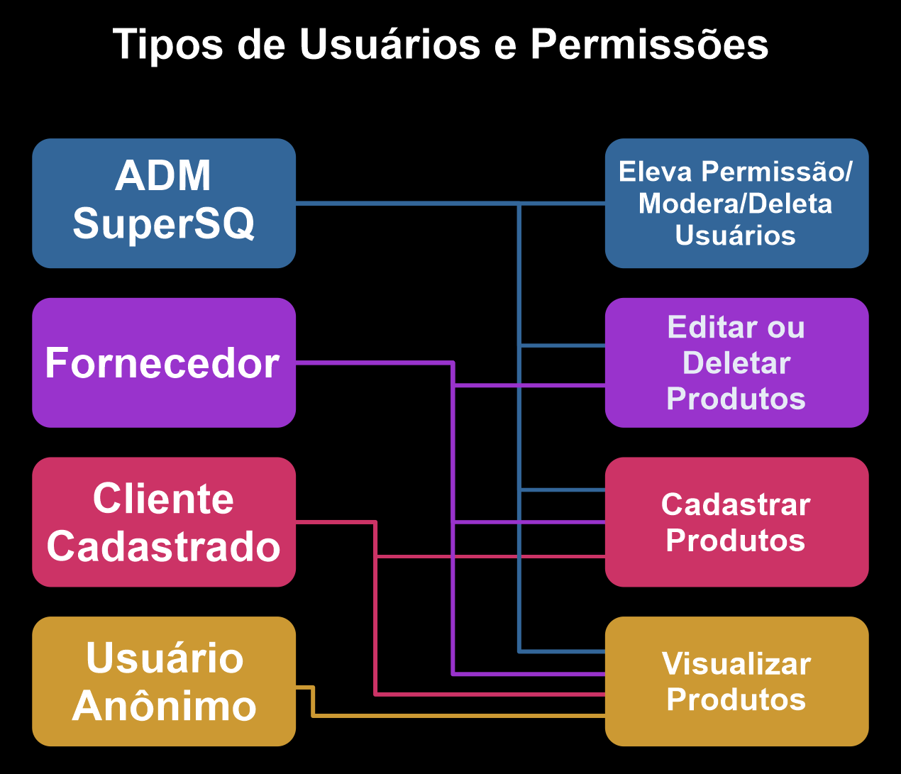
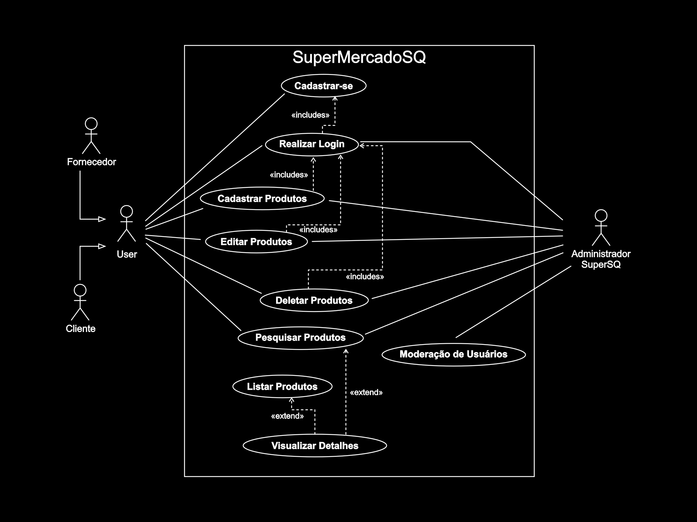
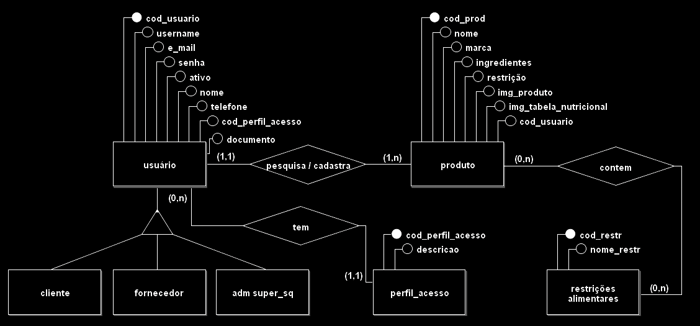
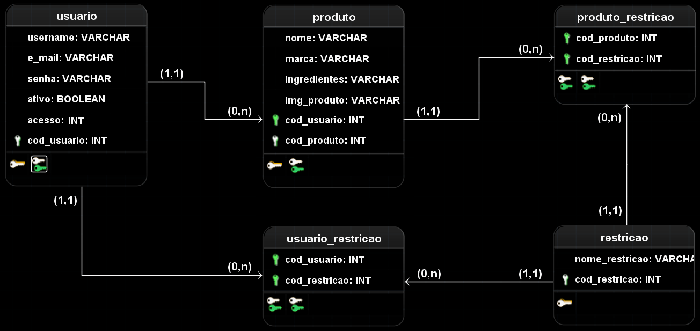

### [👉 Clique aqui para saber como começar a usar 👈](./backend/readme.md)
---
# Projeto - 🛒*Supermercado SQ* 

## Sumário
* [Problemática do Projeto](#problematica)
* [Atores do Sistema](#atores)
* [Elicitação de Requisitos](#elicitacao)
* [Requisitos Funcionais](#requisitos-funcionais)
* [Requisitos Não-Funcionais](#requisitos-nao-funcionais)
* [Regras de Negócio](#regras-negocio)
* [Visão Geral da Aplicação](#visao-aplicacao)
* [Modelagem Conceitual - ER](#modelagem-conceitual)
* [Modelagem Lógica](#modelagem-logica)
* [Requisitos desenvolvidos](#requisitos-desenvolvidos)
* [Habilidades Desenvolvidas](#habilidades-desenvolvidas)
* [Equipe DevHub](#equipe-devhub)
##  🤔 Problemática do Projeto
O *Supermercado SQ* necessita de um sistema de gerenciamento de alimentos e composições alimentares que auxilie seus clientes a saber quais compostos alergênicos estão contidos nos alimentos que serão comprados.

##  📋 Atores do Sistema

##  🤯 Elicitação de Requisitos

###  📑 Requisitos Funcionais

ID|Descrição|
:---:|:---|
RF-01| O sistema deve permitir o cadastro de dados pelos usuários.
RF-02| O sistema deve permitir a visualização dos dados cadastrados
RF-03| O sistema deve permitir a edição dos dados cadastrados
RF-04| O sistema deve permitir a remoção dos dados cadastrados
RF-05| O sistema deve conter dados sobre o produto, como o seu nome e ingredientes
RF-06| O sistema deve permitir a pesquisa de produtos e seus ingredientes
RF-07| O sistema deve permitir a pesquisa de um ingrediente que possa conter o produto em questão
RF-08| O sistema deve permitir a busca por alimentos que não contenham certos ingredientes
RF-09| O sistema deve permitir a busca por alimentos que contenham certos ingredientes
###  📑 Requisitos Não-Funcionais

ID|Descrição|
:---:|:---|
RF-01| A interface do sistema deve se adaptar aos diferentes dispositivos que possam acessá-lo
RF-02| O sistema deve garantir a integridade dos dados de todos os usuários
##  👀 Visão Geral da Aplicação

##  🎲 Modelagem Conceitual - ER

##  🎲 Modelagem Lógica

## Optamos por usar o PostgreSQL e em nossa abordagem criamos as seguintes tabelas:
---
### USUARIO 
Armazenará informações de Usuários (Clientes, Fornecedores e Administradores) onde as colunas:
|Coluna|Função|
|:---:|:---|
**USERNAME** | Será um apelido definido pelo usuário durante o cadastro e será exibido nas interações do dele com o sistema;
**EMAIL** | Será inserido pelo usuário durante o cadastro e será usado para fazer login no sistema;
**SENHA** | Guardará a senha definida pelo usuário durante o cadastro;
**ATIVO** | Armazenará um booleano que por padrão será `true` para novos clientes e poderá ser mudado pelo *Administrador* para `false` inativando a conta(moderação) e `false` para novos Fornecedores, que dependerão da aprovação do *Administrador* para serem ativados;
**ACESSO** | Número que será usado para definir tipos de contas e suas permissões *(`1` para Cliente, `2` para Administrador e `3` para Fornecedor)*;
**COD_USUARIO** | Número auto incrementado usado para identificar os usuários;  

### PRODUTO
Armazenará a lista de produtos cadastrados e associará com as restrições da tabela `RESTRICAO`, tem as seguintes colunas:
|Coluna|Função|
|:---:|:---|
**NOME** | nome do produto para consulta/exibição;
**MARCA** | marca do produto;
**INGREDIENTES** | armazenará a lista de ingredientes descrita no rótulo do produto;
**IMG_PRODUTO** | armazenará uma foto do produto (ainda estamos estudando como fazer isso);
**IMG_TABELA_NUTRICIONAL** | armazenará uma foto da tabela nutricional do rótulo do produto(ainda estamos estudando como fazer isso);
**COD_USUARIO** | relacionado a tabela `USUARIO` para identificar o usuário que cadastrou o produto;
**COD_PRODUTO** | número auto incrementado que será usado no controle/associação com tabela `RESTRICAO`;

### RESTRICAO
Armazenará a lista de restrições alimentares cadastradas no sistema com seguintes colunas 
|Coluna|Função|
|:---:|:---|
**NOME_RESTRICAO** | armazenará o nome da restrição *ex: glútem, lactose*;
**COD_RESTRICAO** | armazenará um número auto incrementado que será usado na consulta/associação com tabela `PRODUTO`;

### PRODUTO_RESTRICAO
É uma tabela gerada do relacionamento (N;N) entre `PRODUTO` e `RESTRICAO` e será usada para relacionar uma ou várias restrições a um ou vários produtos;
|Coluna|Função|
|:---:|:---|
**COD_PRODUTO** | foreign key de `PRODUTO`;
**COD_RESTRICAO** | foreign key de `RESTRICAO`;

### USUARIO_RESTRICAO
É uma tabela gerada do relacionamento (N;N) entre `USUARIO` e `RESTRICAO` e será usada para relacionar uma ou várias restrições ao perfil do Usuário;
|Coluna|Função|
|:---:|:---|
**COD_USUARIO** | foreign key de `USUARIO`;
**COD_RESTRICAO** | foreign key de `RESTRICAO`;

##  ✅ Requisitos desenvolvidos

ID|Descrição|
:---:|:---|
RF-01| O sistema deve permitir o cadastro de dados pelos usuários.
RF-02| O sistema deve permitir a visualização dos dados cadastrados
RF-03| O sistema deve permitir a edição dos dados cadastrados
RF-04| O sistema deve permitir a remoção dos dados cadastrados
RF-05| O sistema deve conter dados sobre o produto, como o seu nome e ingredientes
RF-06| O sistema deve permitir a pesquisa de produtos e seus ingredientes
RF-07| O sistema deve permitir a pesquisa de um ingrediente que possa conter o produto em questão
RF-08| O sistema deve permitir a busca por alimentos que não contenham certos ingredientes
RF-09| O sistema deve permitir a busca por alimentos que contenham certos ingredientes
###  📑 Requisitos Não-Funcionais

ID|Descrição|
:---:|:---|
RF-01| A interface do sistema deve se adaptar aos diferentes dispositivos que possam acessá-lo
RF-02| O sistema deve garantir a integridade dos dados de todos os usuários
##  🧠 Habilidades Desenvolvidas

### **Hard Skills**:

**Camada de Dados:**
 - Documentação básica;
 - Modelagem de banco de dados;
 - DDL, DML;
 - PostgreSQL.

**Backend:** 
 - Princípios de NodeJs;
 - Exemplos de uso de MVC;
 - Requisições e respostas HTTP;
 - ExpressJs;
 - JWT.

**Frontend:**
 - Responsividade com ReactJS;
 - Axios;
 - Integração com backend;
 - Autenticação;

### **Soft Skills**:
 - Comunicação;
 - Noção de desempenho necessário para a execução das tecnologias;
 - Comunicação eficaz;
 - Organização;
 - Empatia;
 - Tomadas de Decisões;
 - Autoconfiança;
 - Pensamento inovador.

---
<!-- Tabela com Integrantes do Grupo -->

| | | | |
|:---|:---|:---|:---|
|  | <a href="https://github.com/ismaelzaccah">Ismael Zaccah |  | <a href="https://github.com/javelfreitas">Javel Freitas |
|  | <a href="https://github.com/wiwiaR">Vitória Ribeiro |  | <a href="https://github.com/AglailsonSantiago">Aglailson Santiago |
|  | <a href="https://github.com/andreinamendes">Andreina Mendes |  | <a href="https://github.com/lucassimoes2407">Lucas Simoes |
|  | <a href="https://github.com/BrunoSTB">Bruno Braga |  | <a href="https://github.com/Elaine-G-L">Elaine Guedes

 **DevHub ©** Atlântico Academy Bootcamp
 

---