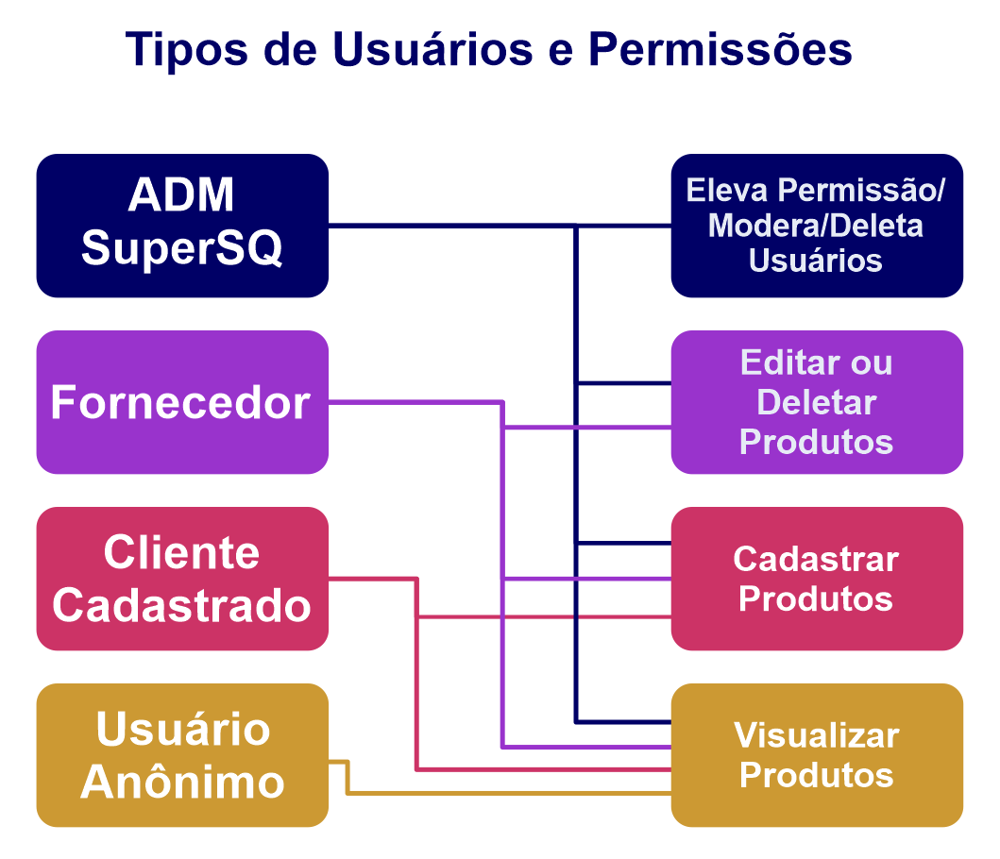
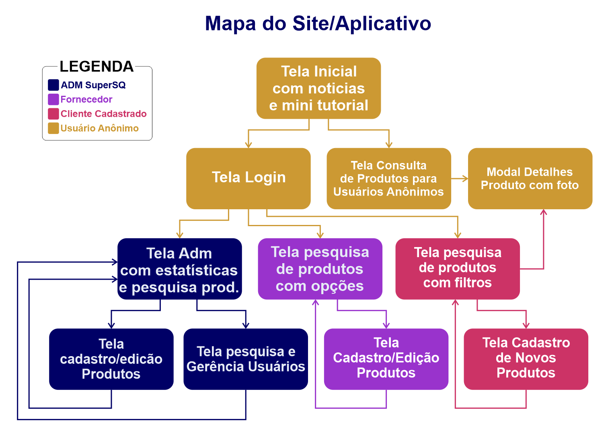

# Projeto - 🛒*Supermercado SQ* 

## 🤔 Problemática do Projeto
O *Supermercado SQ* necessita de um sistema de gerenciamento de alimentos e composições alimentares que auxilie seus clientes a saber quais compostos alergênicos estão contidos nos alimentos que serão comprados.

## 📋 Requisitos do Sistema
Esse sistema poderá ser acessado pelos *administradores do SQ*, pelos *fornecedores* e pelos
*clientes*. O usuário poderá cadastrar produtos industrializados fornecendo quais ingredientes tem em sua composição. Dessa forma, em outros momentos será fácil pesquisar e confirmar se um produto contém ou não determinado ingrediente utilizando essa aplicação. Podendo até ser escalado o seu uso para usuários globais, como uma espécie de comunidade.

* Possibilidade de cadastrar, visualizar, editar e deletar produtos *(utilize banco de dados)*;
* O produto deve ter nome e conter seus ingredientes, *imagem(opcional)*;
* Possibilidade de pesquisar por alimentos e visualizar os ingredientes;
* Na página de visualização do alimento, ter a possibilidade de buscar por um determinado ingrediente (para confirmar se este ingrediente está presente ou não);
* Possibilidade de filtrar alimentos que não tenham determinados ingredientes;
* Possibilidade de filtrar alimentos que tenham determinados ingredientes;

## 📑 Requisitos Funcionais

## 🚧 Em construção 🚧

ID|Descrição|
:---:|:---:|
RF00| 🤔 🤔 🤔 🤔 🤔 🤔 🤔
RF00| 🤔 🤔 🤔 🤔 🤔 🤔 🤔
---

## 👀 Visão Geral da Aplicação

## 💻 Telas identificadas até o Momento

### Home

* Slide com Noticias relacionadas
* Mini tutorial de uso do sistema
* Login
* Rodapé

### Consulta de Produto *(sem Cadastro)*

* Consulta de Produtos
    * Detalhes *=> Direciona Detalhes Produto*
* Filtrar Alergênicos para ocultar
* Filtrar Alergênico para mostrar
* Cadastrar Produto *=> Direciona para Login*

### Login

* Usuário
* Senha
* Esqueci a senha
* Criar conta

### Cadastro de Usuário

* Nome
* CPF
* Telefone
* Solicitar cadastro Administrativo ou de Fornecedor
    * Nome Representante
    * CNPJ da empresa representada
    * Telefone

### Home Cliente Logado

* Consulta de Produtos
    * Detalhes *=> Direciona Detalhes Produto* 
* Filtrar Alergênicos para ocultar
* Filtrar Alergênico para mostrar
* Cadastrar Novo Produto
* Definições de Conta e Preferencias
* Logout

### Home Fornecedor 

* Consulta de Produtos
    * Detalhes *=> Direciona Detalhes Produto*
* Filtrar Alergênicos para ocultar
* Filtrar Alergênico para mostrar
* Cadastrar Novo Produto
* Definições de Conta e Preferencias
* Logout

### Home Administrador 

* Painel Estatisticas
* Consulta de Produtos
    * Detalhes *=> Direciona Detalhes Produto*
* Gerenciar Usuarios *=> Gerencia de Usuários*
* Definições de Conta e Preferencias
* Logout

### Cadastro de Produto *(Cliente Logado)*

* Nome produto
* Marca
* Lista igredientes
* Possíveis Alergênicos
* Imagem
* Salvar

### Detalhes de Produto *(Cliente Logado)*

* Nome produto
* Marca
* Lista igredientes
    * Pesquisar na Lista
* Possíveis Alergênicos
    * Pesquisar na lista
* Imagem
* Salvar

### Tela Alteração Perfil
* Nome
* CPF/CNPJ
* Telefone
* Solicitar Deleção de Conta e Dados

### Detalhes de Produto *(Adm ou Fornecedor Logado)*

* Cod Produto
* Nome produto
* Marca
* Lista igredientes
    * Pesquisar na Lista
* Possíveis Alergênicos
    * Pesquisar na lista
* Imagem
* Salvar
* Imagem Produto
    * Cod Usuário que cadastrou
    * Nome Usuário que cadastrou
* Botão para Editar *=> Direciona edição produto
* Remover Produto da Base de Dados

### Cadastro/Edição de Produto *(Adm ou Fornecedor Logado)*

* Cod Produto
* Nome Produto
* Marca
* Lista Ingredientes
* Possiveis Alergênicos
* Imagem Produto
    * Cod Usuário que cadastrou
    * Nome Usuário que cadastrou
* Salvar Alterações
* Remover Produto da Base de Dados

### Gerencia Usuários *(Adm Logado)*

* Solicitações de Cadastros como Fornecedores
  * Modal Detalhes Usuário
  * Aprovar/Rejeitar
* Campo Pesquisa Usuario
  * Modal Detalhes Usuário
  * Deletar Cadastro

## 🎲 Modelagem ER

## 🚧 Em construção 🚧

## 🎲 Modelagem Lógica

## 🚧 Em construção 🚧

---

### Desenvolvido pela equipe **DevHub ©** Durante o Atlântico Academy Bootcamp

